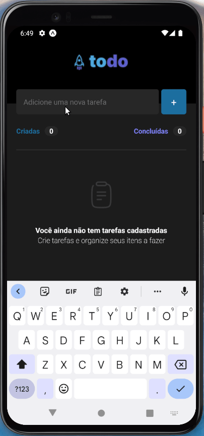

<h1 align="center">
    <p>React Native 01 - to-do list<p>
</h1>

## About 
 
**To do** is a simple project designed to training some reactive native basics learnings, just an to do list when you can register some things that you want to do and has the option to check when the task are done

## Tools and Features

- [React](https://reactjs.org/)
- [React Native](https://reactnative.dev/)
- [TypeScript](https://www.typescriptlang.org/)
- [Hooks: useState](https://legacy.reactjs.org/docs/hooks-state.html)

## If you wanna try

```bash
    # Clone Repository
    $ git clone https://github.com/Renatoogata/React-Native-Project01-Todo.git
``` 

```bash
    # Install the dependencies
    $ npm i
```

```bash
    # Im runing with expo, just enter in your project dir and run
    $ expot start
```

## Images and gifs




## Updates
- Fixed Count of finished tasks
